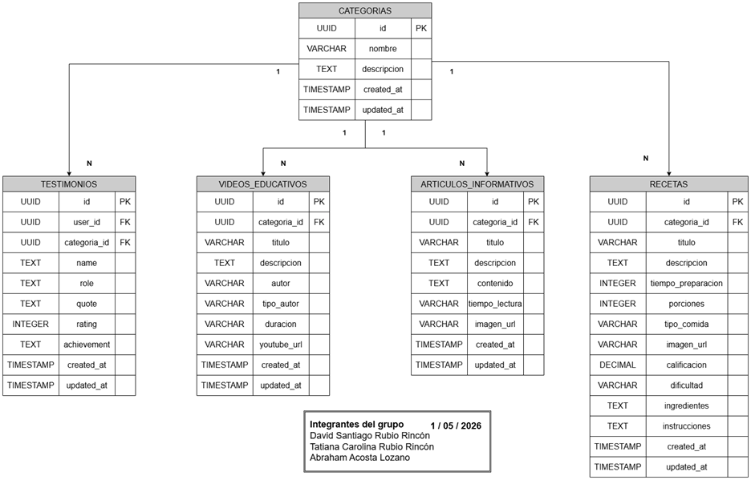

# Modelamiento del Sistema

Esta sección contiene el modelamiento y diagramas del sistema para el proyecto de hábitos alimenticios saludables

# Diagrama estructural
En este diagrama se describen como están relacionados los sistemas por dentro, además de mostrar como están estructurado los diferentes servicios y base de datos utilizados en el proyecto. El diagrama estructural original puede ser consultado en el Anexo del presente documento.

Nota. Representación visual del diagrama estructural. Fuente: Elaboración propia en Daw.io.

# Diagrama de comportamiento

En este diagrama de secuencia se describe como el proceso de interacción entre el sistema y el usuario al momento de consultar una receta o descargar un archivo PDF, mostrando la comunicación entre el cliente, el servidor, la base de datos y el servicio de almacenamiento. El diagrama de comportamiento original puede ser consultado en el Anexo del presente documento.

Nota. Representación visual del diagrama de comportamiento. Fuente: Elaboración propia en Daw.io.

# Diagrama de caso de uso

En este diagrama se evidencia de forma sencilla las funciones del sistema desde la perspectiva del usuario, además de observarse como es la interacción para acceder al contenido de cada nodo. El diagrama de caso de uso original puede ser consultado en el Anexo del presente documento.

Nota. Representación visual del diagrama de caso de uso. Fuente: Elaboración propia en Daw.io.

# Diagrama entidad-relación (ER)

Este diagrama se usa para diseñar o depurar bases de datos relacionales en proyectos de software. En este diagrama las tablas no se relacionan entre sí mismas porque no se poseen roles como usuario o administrador al ser un sitio web de acceso libre. El diagrama de entidad relación original puede ser consultado en el Anexo del presente documento.

# Descripción general de las entidades principales del sistema

La primera tabla (CATEGORIAS) es la entidad núcleo del sistema, la cual funciona como el eje organizador que agrupa el resto de los contenidos (videos, articulo, recetas y testimonios). El propósito de esta tabla es clasificar la información temática para facilitar la navegación y búsqueda del usuario.
La segunda tabla (VIDEOS_EDUCATIVOS) gestiona el contenido multimedia del módulo Alerta y concientización, su propósito es almacenar recursos visuales orientados al aprendizaje con respecto a los hábitos alimenticios.
La tercera tabla (ARTICULOS_INFORMATIVOS) representa el contenido textual y de lectura del sitio web, el propósito de esta tabla es ofrecer información detallada, artículos y/o noticias relacionadas con las categorías del sistema.
La cuarta tabla (RECETAS) es una de las tablas o entidades más robustas, diseñada para el seguimiento de hábitos alimenticios, su propósito es proporcionar guías paso a paso para la preparación de recetas saludables en donde se especifican porciones, tiempo de preparación, dificultad, tipo de comida, ingredientes e instrucciones.

## Enlace Diagrama entidad-relación (ER)

https://drive.google.com/file/d/1_cJliFIl_a9pX82EXzgMYBwo4BysWFXm/view?usp=sharing 