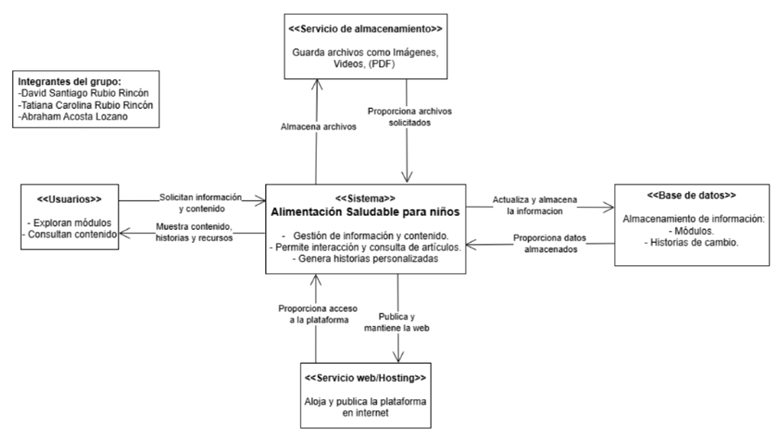
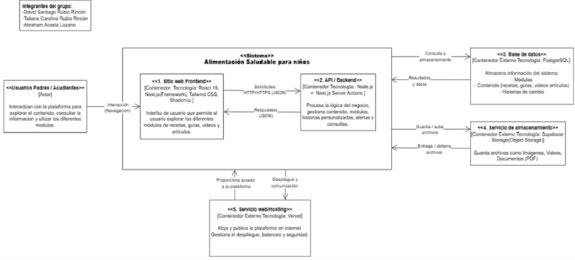

# Arquitectura del sistema

En los siguientes diagramas se evidencia la arquitectura del sitio web “Alimentación Saludable Infantil”, donde el diagrama de nivel donde se mostrará de forma general la estructura del sistema, en cambio, el diagrama de nivel muestra las interacciones del sistema a nivel interno de los contenedores y tecnologías que se utilizan en el proyecto.

## Diagrama de nivel 1 (Contexto)

Este diagrama de nivel 1 (Contexto) C4 se estructura una visualización de forma general y superficial mostrando como el sistema interactúa sin detalles de mayor complejidad con el usuario y/o los servicios.

## Enlace Nivel 1 (Contexto)
https://drive.google.com/file/d/1DlnFlLIWmv5CntelchJKK93gd31Cs1io/view?usp=sharing

## Diagrama de nivel 2 (Contenedores)

Este diagrama de nivel 2 (Contenedores) C4, muestra como está dividido y estructurado el sistema de manera interna en partes principales que se determinan como contenedores donde están las diferentes interacciones entre el sistema y sus servicios.

Enlace Nivel 2 (Contenedores)
https://drive.google.com/file/d/1K4AJjZ2jM1cgIxcytUL-DShQdGKjtML-/view?usp=sharing

