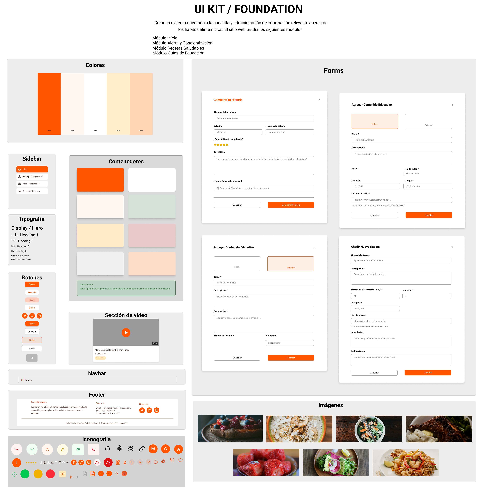

# Prototipo funcional del sistema

En el prototipo de alta fidelidad se desarrolló el diseño con los colores apropiados según la psicología estudiada. Además, se estructuró el prototipo del sitio web con enfoque al resultado final esperado del producto digital con las conexiones entre sus distintos módulos y/o Frames, sin dejar de lado los detalles necesarios de manera realista y funcional con el objetivo de que los usuarios que participen en las pruebas de usabilidad tengan una mejor experiencia.

_de_prototipo_de_alta_fidelidad.png)

## Enlace de prototipo – Alta Fidelidad

https://www.figma.com/design/oTqyYm747XroYGM6x3KwxP/PROTOTIPO-ALTA-FIDELIDAD-PS?node-id=0-1&t=JJFfLp21kE7TZFx5-1 

# UI Kit / Foundation

El UI Kit / Foundation del sitio web “Alimentación Saludable Infantil” constituye la columna vertebral estética y funcional del proyecto. Su objetivo es garantizar la consistencia visual y facilitar la escalabilidad del desarrollo mediante la creación de una librería que contenga componentes reutilizables con el propósito de optimizar tiempos de diseño con interfaces futuras.

## Enlace de prototipo – Alta Fidelidad

https://www.figma.com/design/oTqyYm747XroYGM6x3KwxP/PROTOTIPO-ALTA-FIDELIDAD-PS?node-id=365-485&t=smgJm8Rw97v6Zbgl-1 
