# Pruebas de usabilidad

__Nombre del proyecto:__ Alimentación Saludable Infantil
__Versión del prototipo:__ Versión evaluada, V1.0.0 – Prototipo Alta fidelidad
__Fecha de la prueba:__ 28 – 04 - 2026
__Equipo responsable:__ Tatiana Carolina Rubio Rincón, David Santiago Rubio Rincón, Abraham Acosta Lozano
__Herramientas usadas:__ Figma, Maze.

## Enlace de Pruebas de Usabilidad

https://t.maze.co/527325861 

## Enlace Resultados de Pruebas de Usabilidad

https://app.maze.co/report/PROYECTO-DE-SOFTWARE-PRUEBA-DE-USABILIDAD/11t9jd1u7moem3a9h/intro 

# Resultados de Pruebas de Usabilidad

__Objetivos de la prueba:__ Evaluar la compresión de la navegación dentro del módulo Inicio, el flujo del sitio web y conocer que tan intuitiva es para los usuarios al momento de compartir una historia de éxito.

__Número de participantes:__ 5 participantes respondieron la prueba de usabilidad.

__Tareas / Escenarios / Resultados:__

__Pregunta 1:__ Explora el módulo Inicio y la sección de Historia de Cambio y Éxito.
Imagina que acabas de llegar por primera vez a nuestro sitio web. Quieres ver e incluir una historia de cambio y éxito de alguna mejora de hábitos de tu hijo, así que busca la sección donde puedas incluir tu testimonio.

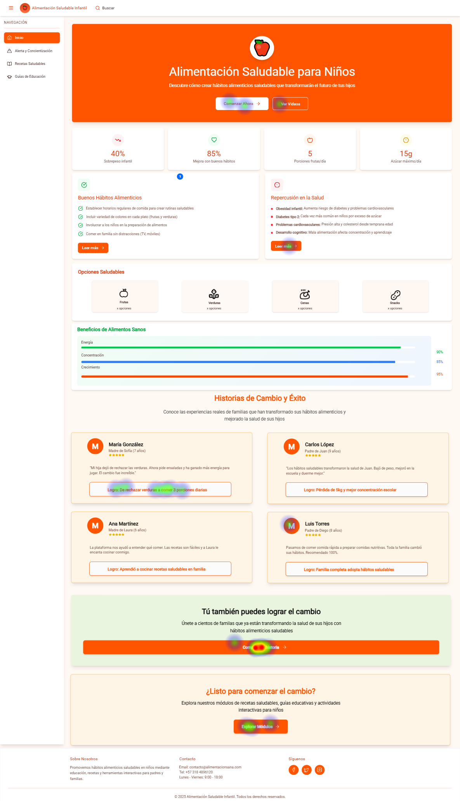

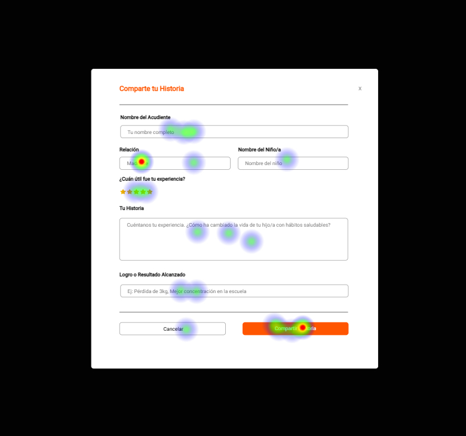

__Objetivo:__ Explorar el módulo de inicio y compartir una historia de cambio y éxito.

__Tiempo promedio estimado:__ 46.604 segundos.

__Dificultad:__ Baja.

__Interpretación:__ Este módulo está bien estructurado, presenta un nombre claro y por ende el usuario reconoce la tarea sin esfuerzo alguno.

__Pregunta 2:__ Explora el módulo de Alerta y Concientización.
Imagina que eres un padre preocupado por los efectos de una mala alimentación.
Tu objetivo es encontrar el botón para agregar contenido y revisar los detalles de algún artículo informativo; navega por el sitio web hasta ubicar el botón correspondiente.

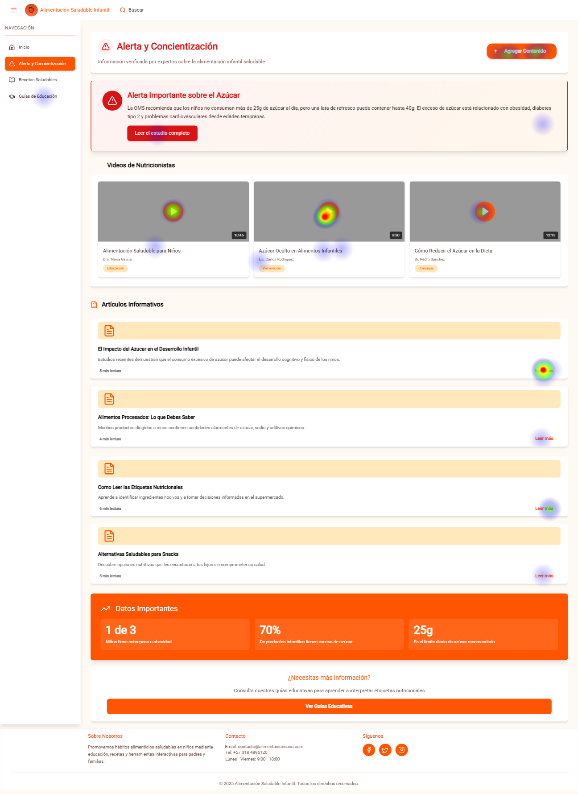

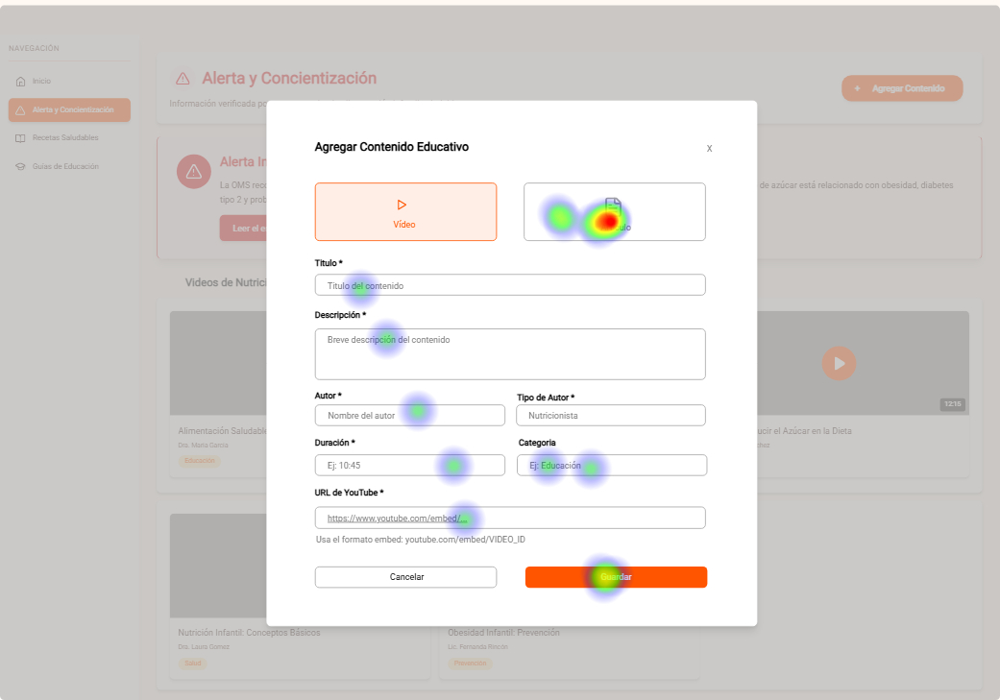

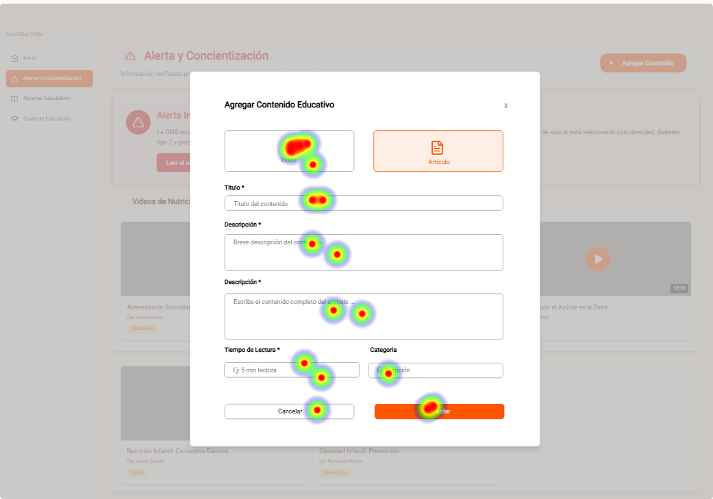

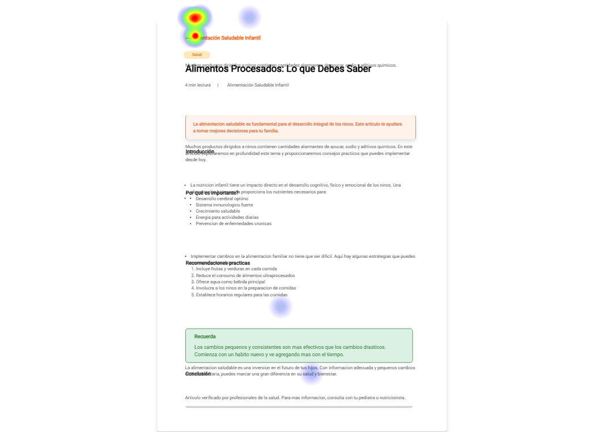

__Objetivo:__ Explorar el módulo de alerta y concientización hasta encontrar el botón de agregar contenido y visualizar un artículo informativo a detalle.

__Tiempo promedio estimado:__ 107.26 segundos.

__Dificultad:__ Media.

__Interpretación:__ Este módulo está bien estructurado, presenta un nombre claro, por consiguiente, el usuario reconoce la tarea sin esfuerzo alguno y conoce las funcionalidades de este módulo más a fondo.

__Pregunta 3:__ Explora el módulo de Recetas saludables.
Imagina que eres un padre comprometido con mejorar los hábitos alimenticios de los niños.
Tu objetivo es visualizar opciones de recetas e incluirlas en la alimentación y explora el botón de añadir receta.
Navega por el sitio hasta encontrar el espacio donde puedas hacerlo.

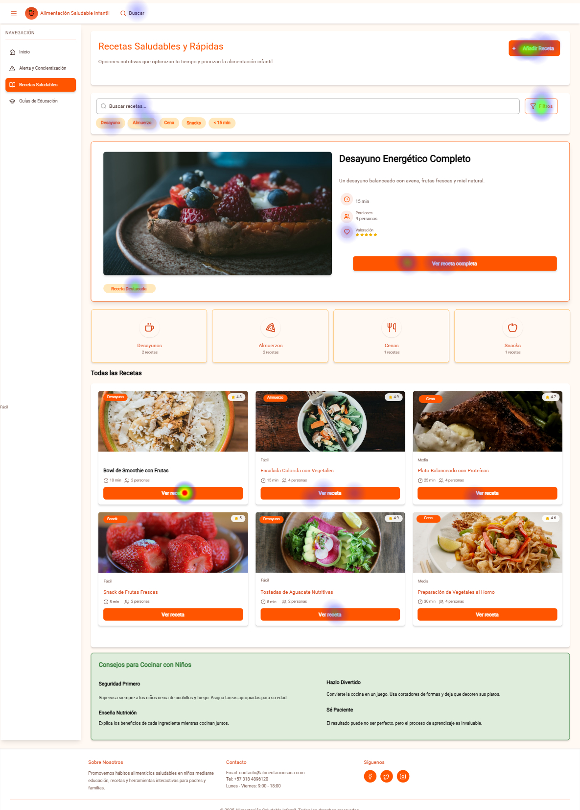

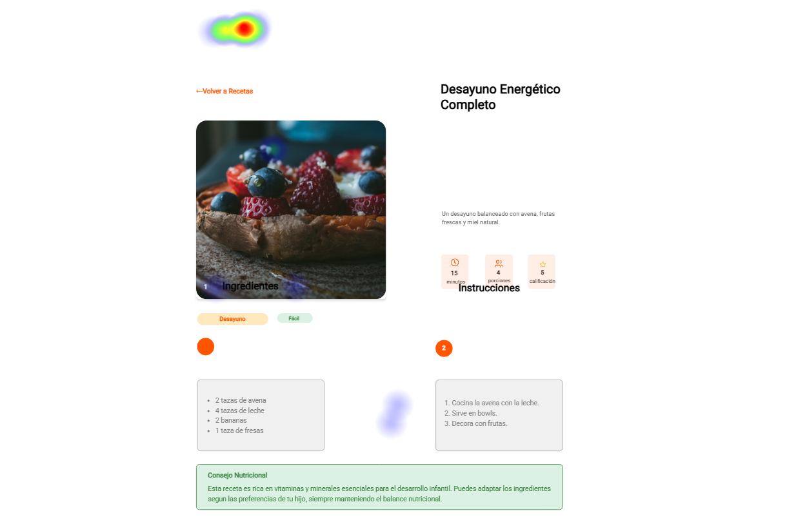

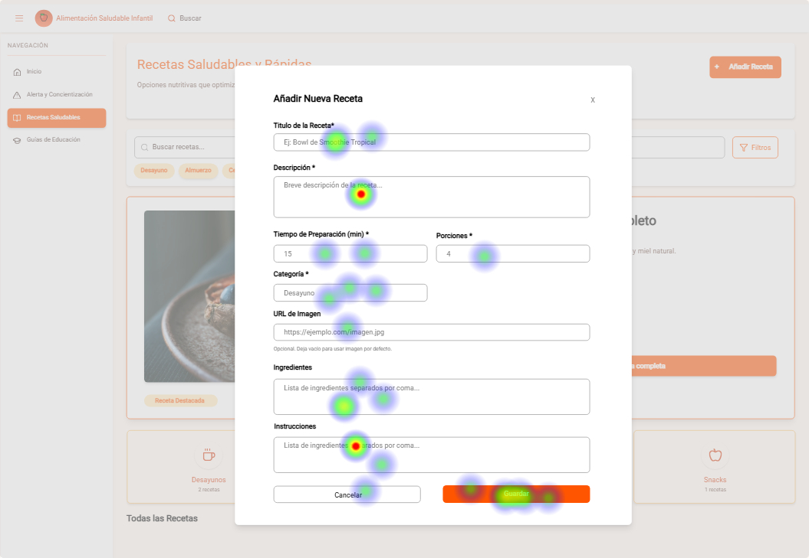

__Objetivo:__ Explorar el módulo de recetas hasta ver los detalles de alguna receta y encontrar el botón de agregar receta.

__Tiempo promedio estimado:__ 84.052 segundos.

__Dificultad:__ Baja.

__Interpretación:__ Este módulo generó poco esfuerzo en los usuarios que participaron en la prueba de usabilidad, donde se puede decir que los usuarios comprendieron las funcionalidades del módulo “Recetas saludables”.

__Pregunta 4:__ Descubre guías educativas.
Después de explorar diferentes módulos del sitio, quieres aprender más sobre buenos hábitos alimenticios.
Tu tarea es descargar una guía educativa.

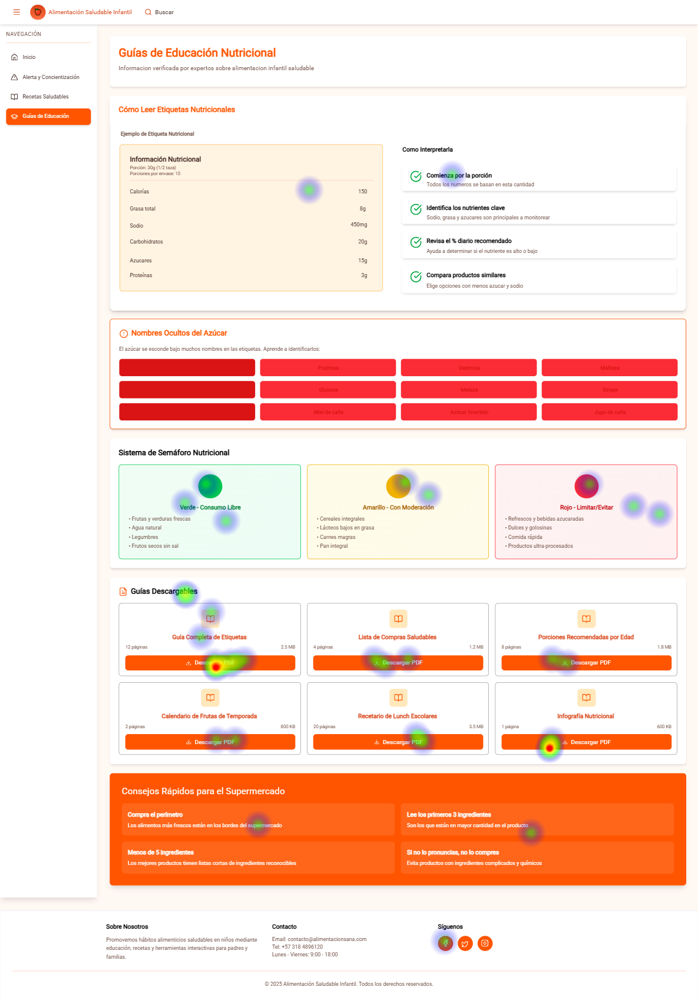

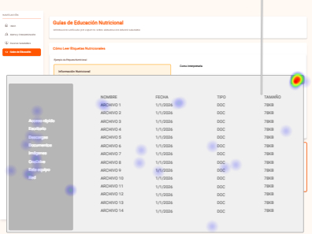

__Objetivo:__ Explorar el módulo de guías educativas donde el usuario pueda descargar guías educativas.

__Tiempo promedio estimado:__ 27.412 segundos.
Dificultad: Baja.

__Interpretación:__ Este módulo fue muy intuitivo para los usuarios a la hora de navegar y encontrar el botón de descargas para simular el guardado de las guías educativas.

__Pregunta 5 Likert: Facilidad de uso__

En una escala del 1 al 5, ¿Qué tan fácil te resultó completar la misión en el sitio web? Donde 1 es muy difícil y 5 es muy fácil.

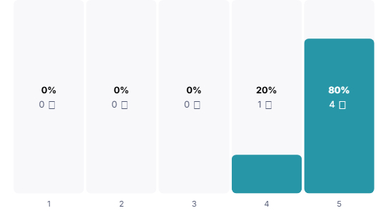

__Interpretación:__ La mayoría percibió que completar las misiones fue sencillo. Refuerza que la estructura general el prototipo es comprensible y no requiere aprendizaje previo.

__Pregunta 6 Likert: Evaluar navegación__

En una escala del 1 al 5, ¿Qué tan intuitiva te pareció la navegación del sitio web? Donde 1 es muy difícil y 5 es muy fácil.

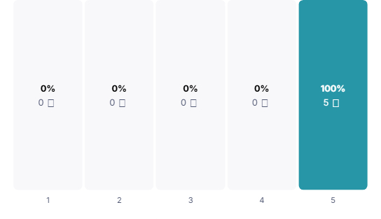

__Interpretación:__ Todos los encuestados percibieron como intuitiva, obteniendo en 100% de votaciones en la escala más alta de votación.

__Pregunta 7 Likert: Evaluar satisfacción general__

En una escala del 1 al 5, ¿Qué tan satisfecho se encuentra con su experiencia durante la prueba? Donde 1 es muy difícil y 5 es muy fácil.

__Interpretación:__ Los usuarios se sintieron satisfechos durante la experiencia. Esto indica que, el prototipo genera una percepción positiva.