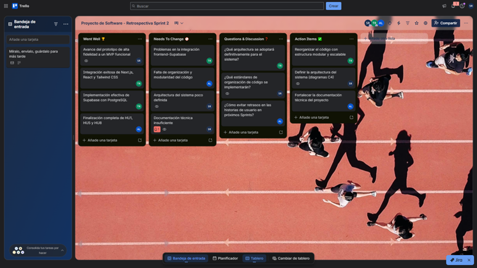
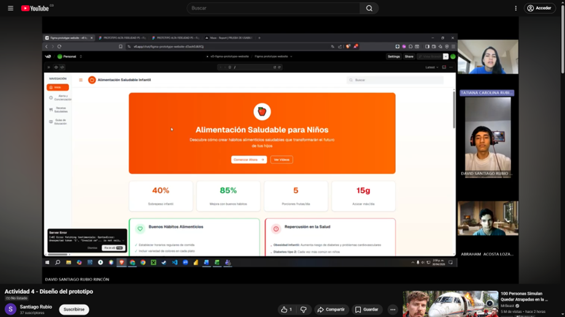

# Retrospectiva del Sprint

La retrospectiva del Sprint permite analizar el proceso de desarrollo del proyecto identificando los aspectos positivos, las dificultades presentadas y las oportunidades de mejora. Este proceso es fundamental dentro de las metodologías ágiles, ya que facilita la optimización continua del trabajo en equipo y del producto desarrollado.

## Enlace - Retrospectiva del Sprint

https://trello.com/invite/b/69f515e765307e6b10fb2336/ATTI3aefa16f0e40149c319bd6535e6d4180252757A0/proyecto-de-software-retrospectiva-sprint-2 

## Enlace de vídeo 

https://youtu.be/5tu5MpkMbvc 

