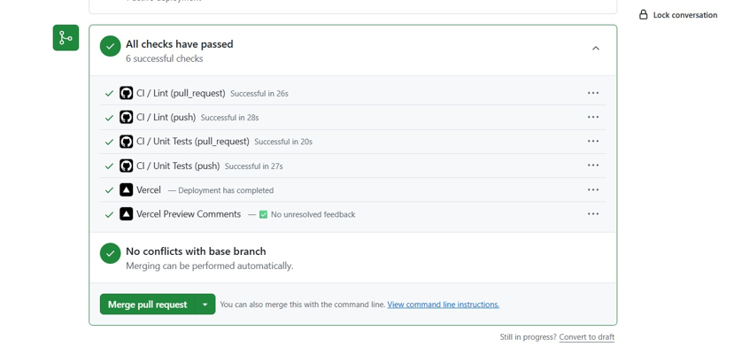
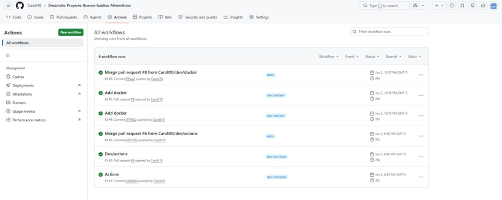
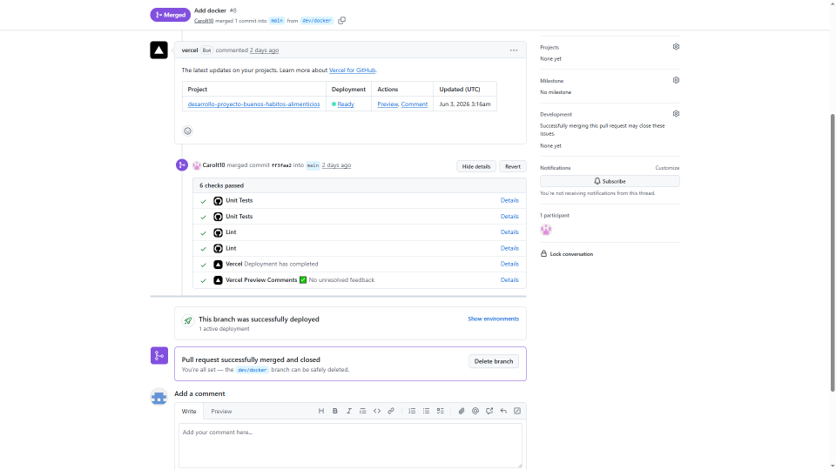

# Pipeline de CI/CD 

## Configuración de la automatización con GitHub Actions
Para dar cumplimiento a los requerimientos de calidad y automatización del proyecto, se diseñó e implementó un flujo de trabajo de Integración Continuas (CI) utilizando GitHub Actions. La configuración del pipeline se estructuró a través de un archivo declarativo de automatización en formato YAML, el cual define las reglas de ejecución y los disparadores (triggers) del sistema.

__•	Disparador en Pull Request:__ El pipeline está configurado para ejecutarse de manera obligatoria cada vez que se abre o actualiza un Pull Request hacia las ramas principales. Esto actúa como una compuerta de calidad que impide la integración de código defectuoso.

__•	Disparador en Push / Merge:__ Al realizar la aprobación y mezcla de los cambios hacia la rama main, el pipeline procesa la versión final para su posterior distribución.

## Etapas y tareas automatizada del pipeline (CI)
Durante cada ejecución del pipeline, el servidor remoto de GitHub levanta un entorno aislado donde ejecuta secuencialmente las siguientes fases de verificación:

__•	Instalación y construcción (Build):__ Se inicializa el entorno de ejecución, se instalan las dependencias del proyecto y se compila el código fuente para asegurar que la aplicación construya correctamente y no existen errores de compilación estática.

__•	Análisis estático de código (Lint):__ A través de herramientas de linting, el pipeline de forma automatizada evalúa que el código escrito cumpla estrictamente con las reglas sintácticas, estándares de formato y buenas prácticas definidas para el proyecto, rechazando cualquier entrega con malas estructuras de desarrollo.

__•	Ejecución de pruebas automatizadas (Unit & Integration Tests):__ Se dispara de forma automatizada la suite de pruebas unitarias e integradas mediante la herramienta de testing, garantizando que el nuevo código conserve la estabilidad y funcionalidad del sistema sin romper las características existentes evitando regresiones.

## Evidencias de ejecución exitosa del pipeline
A continuación, se presentan las capturas de pantalla que soportan el correcto funcionamiento y la estabilidad del flujo CI/CD implementado en el repositorio oficial del proyecto:

__•	Verificación de políticas de calidad en el Pull Request__

Como se observa en la gráfica, al registrarse una solicitud de cambio, el sistema ejecuta de forma paralela y automatizada las tareas de CI / Lint y CI / Unit Tests tanto para evento de push como de pull_request. Al obtener un resultado satisfactorio en todos los componentes junto con la previsualización de construcción, GitHub habilita de forma segura la integración de la rama al no detectar conflictos de código.

__•	Historial de estabilidad del pipeline__

Con el fin de demostrar la consistencia y repetibilidad del pipeline, se presenta el registro histórico de la pestaña Actions. Se evidencian de forma consecutiva un total de 6 ejecuciones exitosas, asociadas a diferentes etapas de desarrollo. Esto valida que el pipeline es completamente estable, seguro y funcional ante múltiples despliegues continuos.

__•	Configuración del Despliegue Continuo (CD) a Producción__

Una vez que el pipeline de integración (CI) valida que el código es óptimo, entra en funcionamiento la capa de Despliegue Continuo (CD), la cual se encuentra vinculada directamente con la plataforma de infraestructura en la nube Vercel.

La imagen demuestra la automatización del cierre del ciclo de DevOps. En el momento en que el líder técnico o el equipo realiza el Merge del commit aprobado hacia la rama principal (main), Vercel intercepta el evento de forma automática, compila la versión final de producción y actualiza el servidor en la nube de manera transparente y sin interrupciones en el servicio, confirmando el mensaje definitivo “This branch was successfully deployed”.

La implementación de esta arquitectura de CI/CD mediante GitHub Actions y Vercel reduce drásticamente el error humano en las fases de despliegue, automatiza el control de calidad del código en tiempo real y garantiza que el entorno de producción contenga siempre una versión de software estable, probada y completamente óptima para el usuario final.
