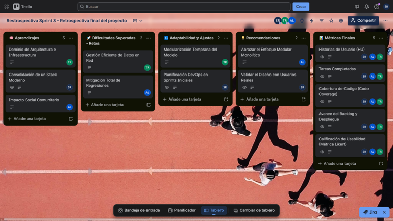

# Retrospectiva final del proyecto

Vista general del tablero de Trello utilizado para consolidar la retrospectiva final del proyecto. El tablero está estructurado en cinco listas que sintetizan el cierre del ciclo de vida del software.

## Enlace de retrospectiva final del proyecto
https://trello.com/invite/b/6a2390b65c6b1070808a399a/ATTIb0210e3bf970992a9c6549a1eb36fc1a879536B5/restrospectiva-sprint-3-retrospectiva-final-del-proyecto 

__Enlace Repositorio documental:__ https://github.com/Carolt10/Proyecto-Buenos-habitos-Alimenticios/tree/Abraham-Acosta 

__Enlace Repositorio código:__ https://github.com/Carolt10/Desarrollo-Proyecto-Buenos-habitos-Alimenticios/tree/main

# Conclusiones

El despliegue del sitio web para el Jardín Infantil Semillero de la ciudad de Ibagué demuestra que una solución web interactiva es un canal idóneo para democratizar la educación nutricional en entornos familiares, contrarrestando activamente la desinformación sobre el consumo de ultraprocesados en etapas preescolares.

El modelado bajo la metodología C4 y el registro técnico mediante documentos ADR garantizaron una arquitectura limpia, desacoplada y con una estricta separación de conceptos, facilitando su mantenimiento y escalabilidad futura.

La implementación de una arquitectura modular monolítica con Next.js 16, React 19 y Server Actions conectados a Supabase demostró ser altamente eficiente, logrando un rendimiento optimizado, interfaces adaptativas y tiempos de respuesta casi instantáneos.

Haber alcanzado un 100% de cobertura de código en pruebas unitarias y de integración mediante Vitest mitiga significativamente la aparición de regresiones, certificando la estabilidad técnica del software ante escenarios reales de uso.

El diseño del pipeline automatizado de CI/CD con GitHub Actions y Vercel eliminó el error humano en las fases de distribución, asegurando que cada integración cumpla con las compuertas de calidad antes de actualizar el entorno de producción.
